# 电磁学面积分与环路积分 — 图文详解版

> 课件截图来源：胡友秋《电磁学》课程讲义（EM002D/EM005A/EM007A/EM010C）

\newpage

# 第一部分：面积分的三种经典对称性

## 1.1 球对称 → 同心球面高斯面

**核心思想**：球对称分布的电荷，其电场沿径向且大小只依赖于 $r$。

取半径为 $r$ 的同心球面为高斯面，则 $E$ 处处垂直于球面：

$$\oint_S \boldsymbol{E}\cdot d\boldsymbol{S} = E(r) \cdot 4\pi r^2 = \frac{Q_{\text{enc}}}{\varepsilon_0}$$

**典型结果**：

| 带电体 | $r<R$（内部） | $r>R$（外部） |
|--------|-------------|-------------|
| 均匀带电球面 | $E=0$ | $E=\frac{Q}{4\pi\varepsilon_0 r^2}$ |
| 均匀带电球体 | $E=\frac{Qr}{4\pi\varepsilon_0 R^3}$ | $E=\frac{Q}{4\pi\varepsilon_0 r^2}$ |

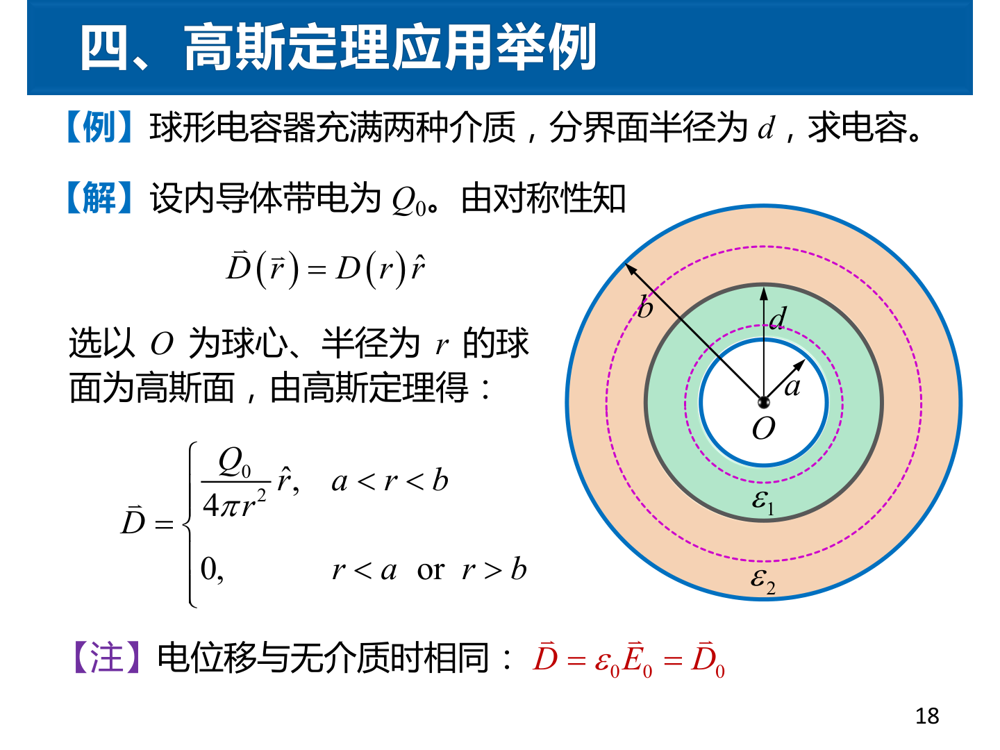

## 1.2 柱对称 → 同轴圆柱面高斯面

**核心思想**：无限长均匀带电直线的电场沿径向，取同轴圆柱面。只有侧面有通量，两端面通量为零。

$$\oint_S \boldsymbol{E}\cdot d\boldsymbol{S} = E(r) \cdot 2\pi r l = \frac{\lambda l}{\varepsilon_0}$$

$$E(r) = \frac{\lambda}{2\pi\varepsilon_0 r}$$

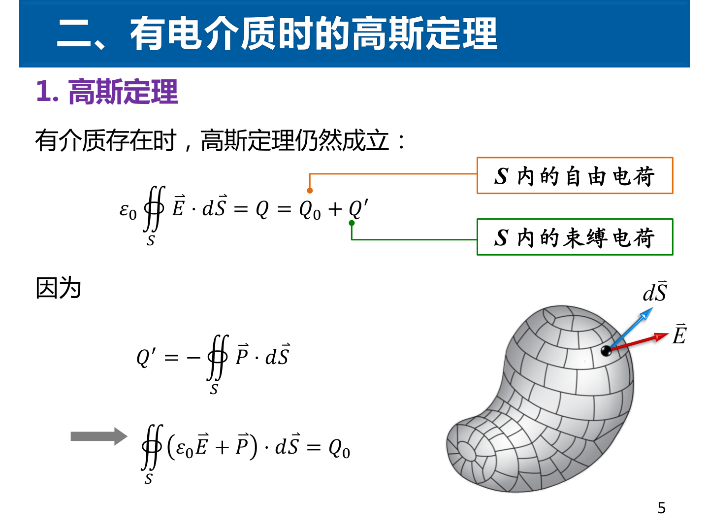

## 1.3 面对称 → 跨平面柱形高斯面

**核心思想**：无限大均匀带电平面的电场垂直于平面。取柱形高斯面跨平面两侧，仅两底面有通量。

$$E \cdot 2S = \frac{\sigma S}{\varepsilon_0} \quad\Rightarrow\quad E = \frac{\sigma}{2\varepsilon_0}$$

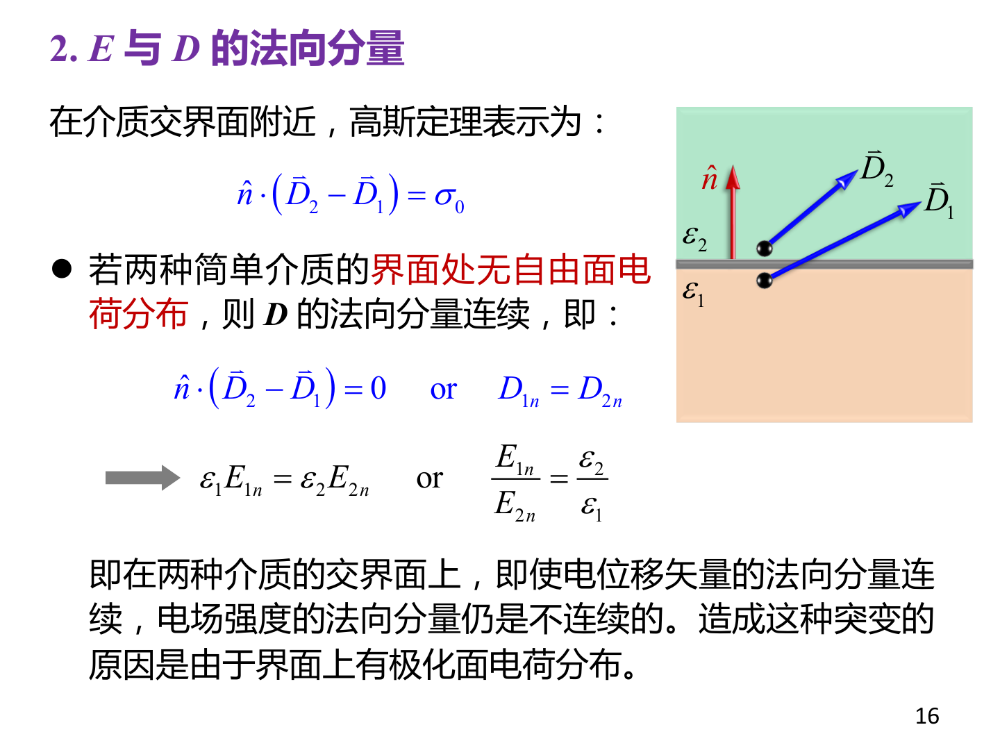

## 含介质的面积分要点

有介质时使用 $\boldsymbol{D}$ 矢量的高斯定理：

$$\oint_S \boldsymbol{D}\cdot d\boldsymbol{S} = Q_f$$

先由自由电荷对称性求 $\boldsymbol{D}$，再由 $\boldsymbol{D}=\varepsilon_0\varepsilon_r\boldsymbol{E}$ 得 $\boldsymbol{E}$。

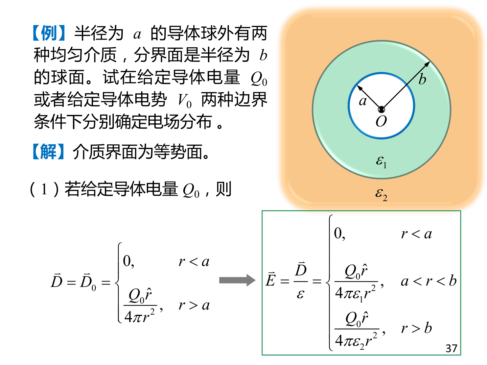

\newpage

# 第二部分：环路积分的四种经典对称性

## 2.1 无限长直载流导线 → 圆形安培环路

**核心思想**：轴对称电流产生的 $\boldsymbol{B}$ 沿环向，取圆形安培环路，$B$ 处处与 $d\boldsymbol{l}$ 平行。

$$\oint \boldsymbol{B}\cdot d\boldsymbol{l} = B(r) \cdot 2\pi r = \mu_0 I$$

$$B(r) = \frac{\mu_0 I}{2\pi r}$$

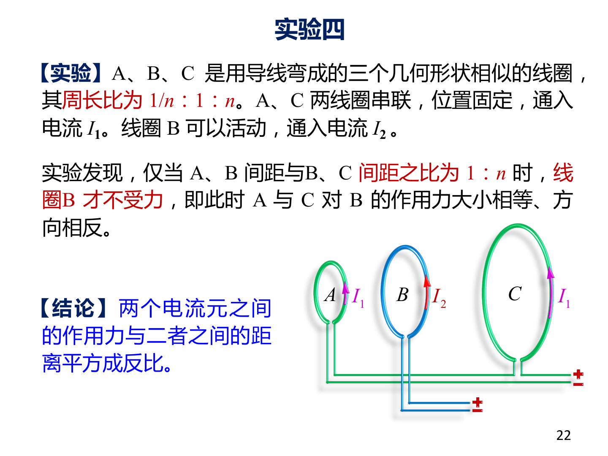

## 2.2 长直螺线管 → 矩形安培环路

**核心思想**：理想螺线管内 $B$ 均匀沿轴向，管外 $B\approx 0$。

取矩形回路（ab在管内∥轴向，cd在管外）：

$$\oint\boldsymbol{B}\cdot d\boldsymbol{l}=B\cdot l = \mu_0\cdot nlI \quad\Rightarrow\quad B=\mu_0 nI$$

**关键领悟**：安培环路定理不仅适用于圆形，**矩形回路也是完全合法的**——只要对称性允许简化环量。

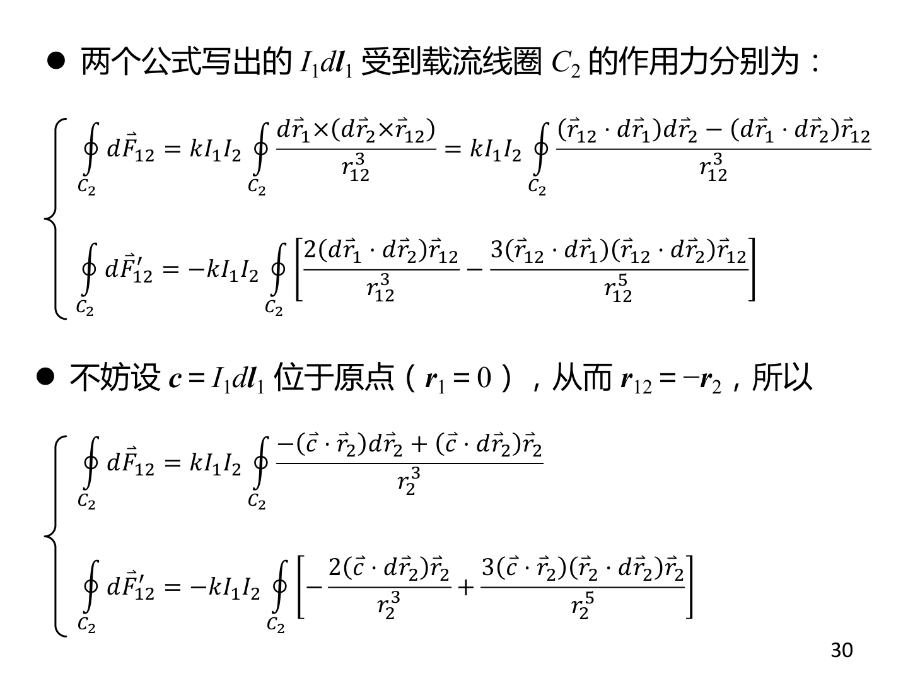

## 2.3 螺绕环 → 环内圆形安培环路

$$\oint\boldsymbol{B}\cdot d\boldsymbol{l}=B(r)\cdot 2\pi r = \mu_0 NI$$

$$B(r) = \frac{\mu_0 NI}{2\pi r}$$

环外 $I_{\text{enc}}=0 \ \Rightarrow\ B=0$。磁场完全被约束在环内——这就是为什么螺绕环是理想的电感元件。

## 2.4 无限大面电流 → 跨平面矩形回路

取矩形回路对称地跨在面电流两侧，$B$ 平行于平面且垂直于电流方向。

$$\oint\boldsymbol{B}\cdot d\boldsymbol{l}=B\cdot 2l = \mu_0\cdot Kl \quad\Rightarrow\quad B=\frac{\mu_0 K}{2}$$

面两侧的 $B$ 大小相等、方向相反。

\newpage

# 第三部分：面积分与环路积分的联动 — 法拉第定律

## 3.1 变化的磁场产生涡旋电场

法拉第定律将面积分（磁通量）和环路积分（电动势）联系起来：

$$\oint_L \boldsymbol{E}\cdot d\boldsymbol{l} = -\frac{d}{dt}\int_S \boldsymbol{B}\cdot d\boldsymbol{S}$$

**左侧是环路积分**（涡旋电场沿回路的环量），**右侧是面积分的时间导数**（通过回路面积的磁通量变化率）。

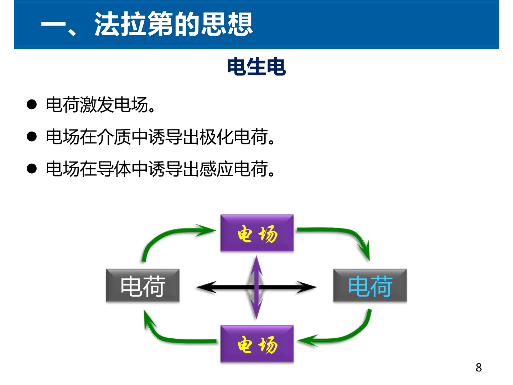

## 3.2 螺线管中变化磁场 → 涡旋电场（经典考题）

管内 $(r<R)$：$\Phi = B\cdot\pi r^2$

$$E\cdot 2\pi r = -\pi r^2\frac{dB}{dt} \ \Rightarrow\ E = -\frac{r}{2}\frac{dB}{dt}$$

管外 $(r>R)$：$\Phi = B\cdot\pi R^2$

$$E\cdot 2\pi r = -\pi R^2\frac{dB}{dt} \ \Rightarrow\ E = -\frac{R^2}{2r}\frac{dB}{dt}$$

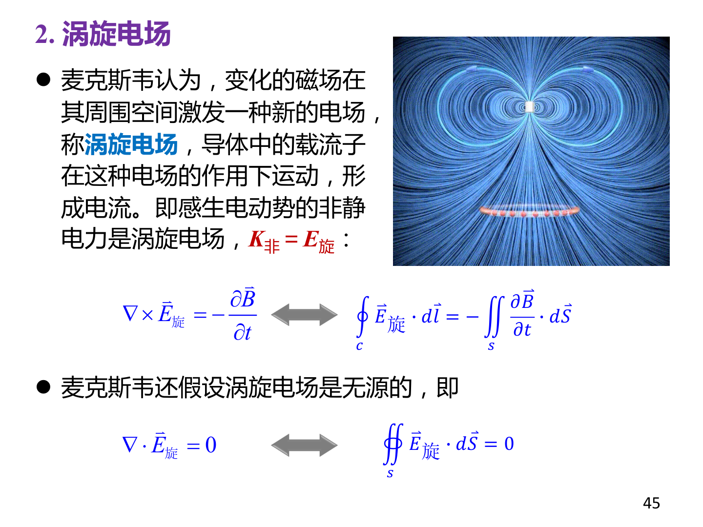

## 3.3 电子感应加速器 — 涡旋电场的实际应用

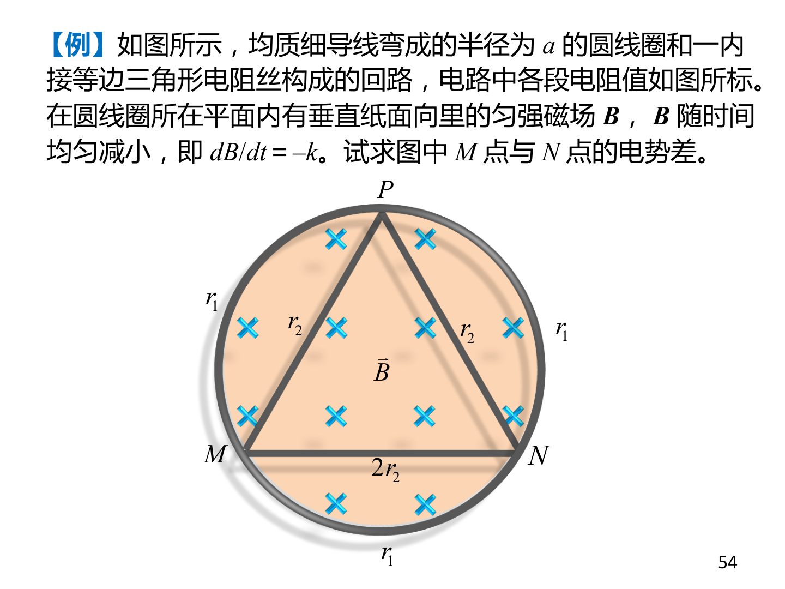

\newpage

# 第四部分：麦克斯韦方程组 — 两大积分的完整统一

麦克斯韦的四个方程恰好是**两个面积分** + **两个环路积分**：

| 方程 | 类型 | 物理意义 |
|------|------|---------|
| $\oint\boldsymbol{D}\cdot d\boldsymbol{S}=Q_f$ | **面积分**（闭合面） | 电场源于电荷 |
| $\oint\boldsymbol{B}\cdot d\boldsymbol{S}=0$ | **面积分**（闭合面） | 无磁单极子 |
| $\oint\boldsymbol{E}\cdot d\boldsymbol{l}=-\frac{d}{dt}\int\boldsymbol{B}\cdot d\boldsymbol{S}$ | **环路积分** | 变磁场生电场 |
| $\oint\boldsymbol{H}\cdot d\boldsymbol{l}=I_f+\frac{d}{dt}\int\boldsymbol{D}\cdot d\boldsymbol{S}$ | **环路积分** | 电流+变电场生磁场 |

## 坡印亭矢量 — 面积分的物理应用

$$\boldsymbol{S} = \boldsymbol{E}\times\boldsymbol{H}$$

$\boldsymbol{S}$ 通过某面积的通量 = 电磁场能量流过该面积的速率。

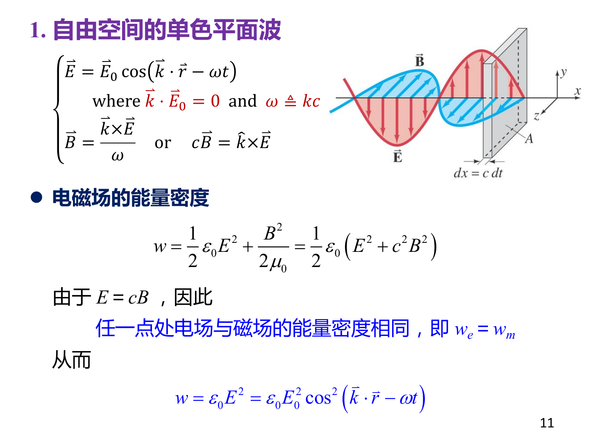

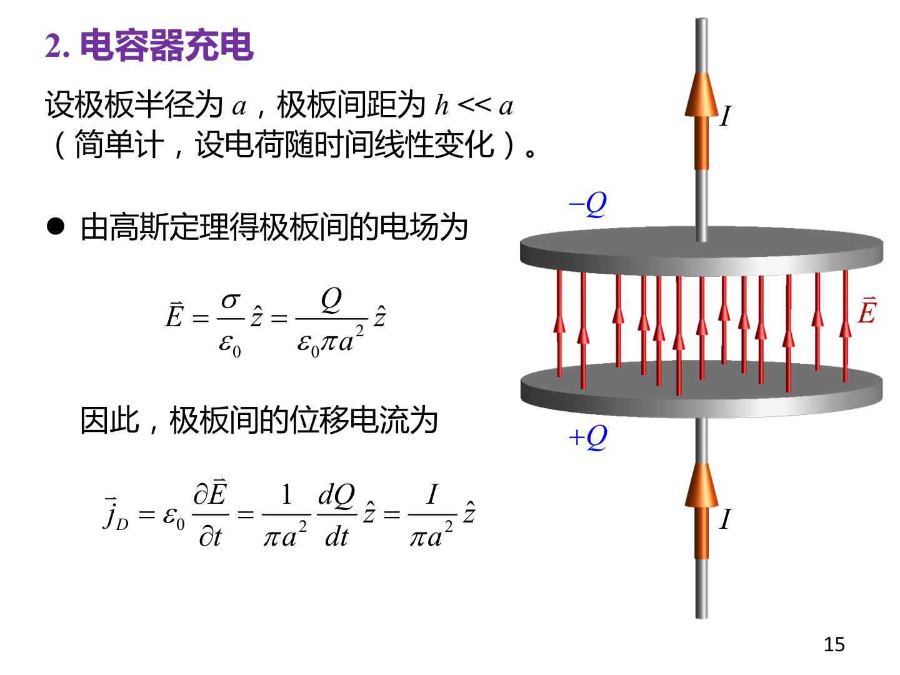

\newpage

# 第五部分：积分计算的统一口诀

## 五步法（适用于所有对称性问题）

| 步骤 | 面积分（高斯定理） | 环路积分（安培定理） |
|------|-------------------|---------------------|
| **① 分析对称性** | 电场方向？只依赖于什么坐标？ | 磁场方向？只依赖于什么坐标？ |
| **② 选积分面/回路** | 球面/圆柱面/柱形面 | 圆形/矩形回路 |
| **③ 确保F∥dS或F∥dl** | $\boldsymbol{E}\parallel\hat{\boldsymbol{n}}$ 处处成立 | $\boldsymbol{B}\parallel d\boldsymbol{l}$ 处处成立 |
| **④ 计算积分** | $\oint\boldsymbol{F}\cdot d\boldsymbol{S}=F\cdot S$ | $\oint\boldsymbol{F}\cdot d\boldsymbol{l}=F\cdot L$ |
| **⑤ 代入定理** | $F\cdot S = Q_{\text{enc}}/\varepsilon_0$ | $F\cdot L = \mu_0 I_{\text{enc}}$ |
| **⑥ 解出F** | $F = Q_{\text{enc}}/(\varepsilon_0 S)$ | $F = \mu_0 I_{\text{enc}}/L$ |

## 一句话总结

> **面积分** = 选对面 × 用法向 = $F \cdot S$
>
> **环路积分** = 选对环 × 用切向 = $F \cdot L$
>
> **共同前提**：对称性足够好，使得 $|\boldsymbol{F}|$ 在积分面/回路上恒定且方向与面法向/路径切向一致。

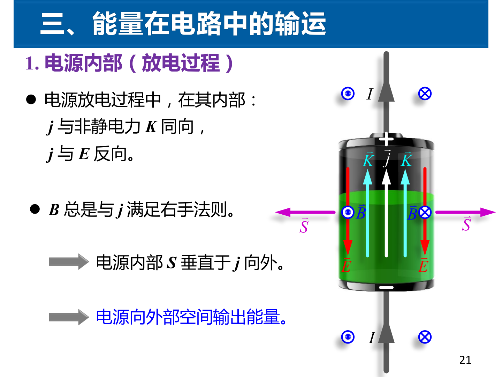

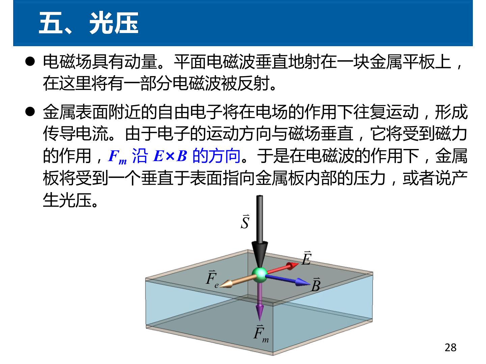
